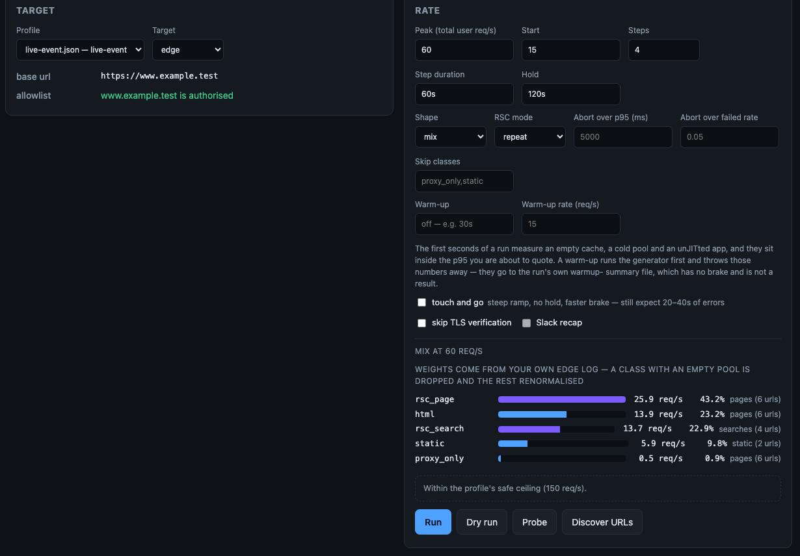
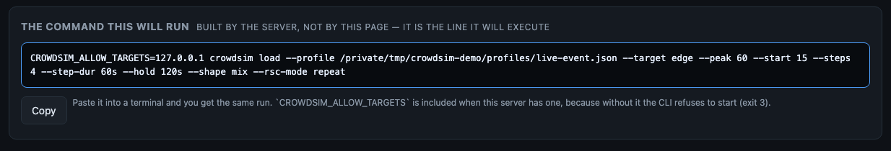
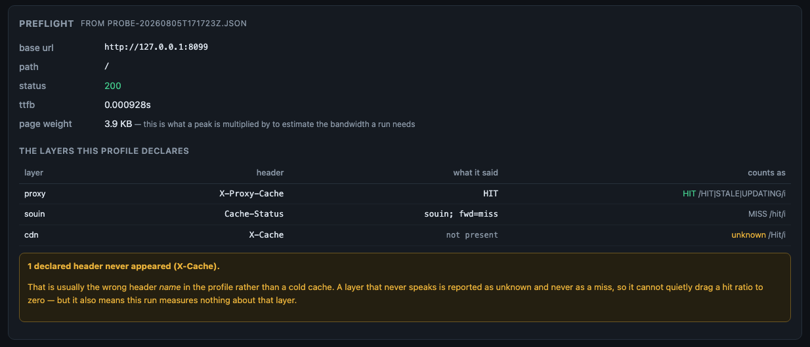
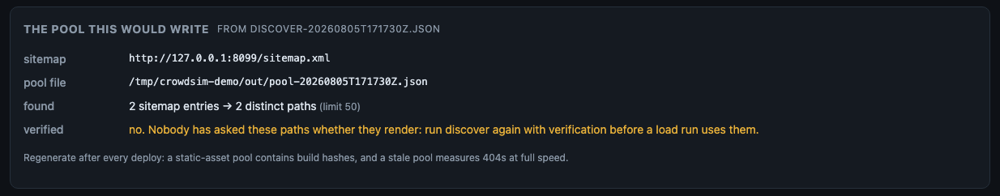
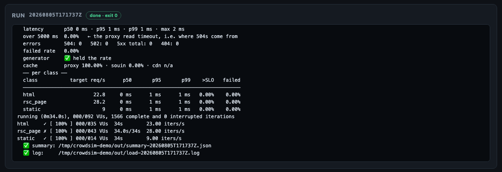
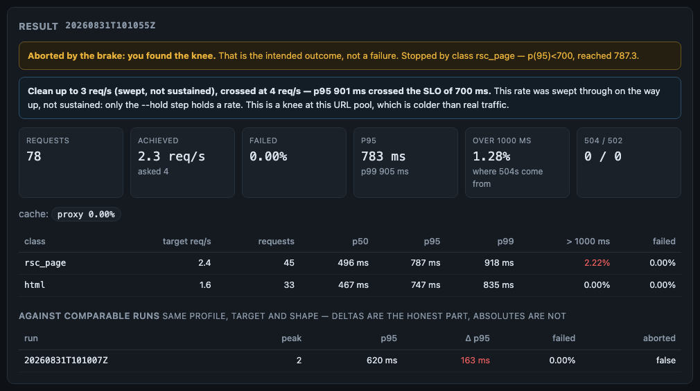
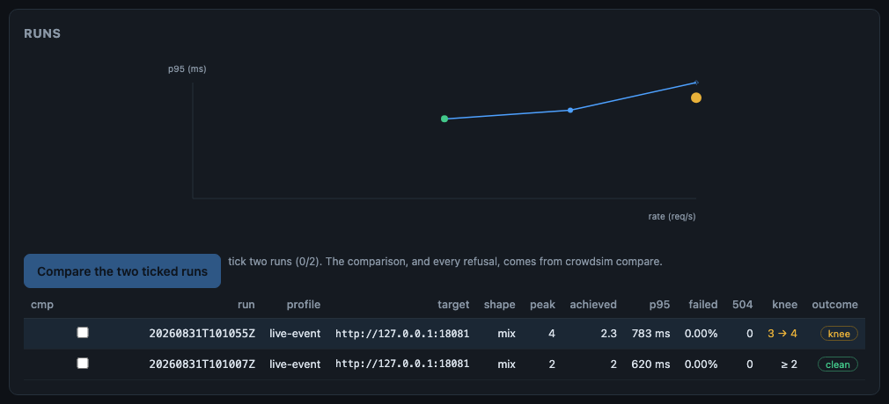
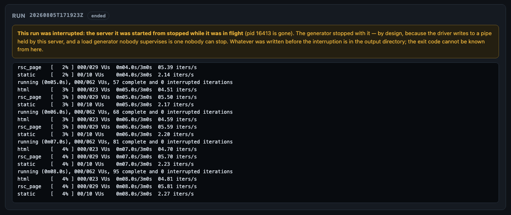

# The GUI

A form over `bin/crowdsim`. Every run is a child process of the same CLI, with the same gates, writing the
same `out/` directory — so a run started from a terminal and a run started from this page are the same kind
of object and land in the same history.

What it adds over the CLI: you can see what a peak *means* per class before you press the button, whether the
target is allowlisted before you press it, **the exact command that is about to run**, the log while it
happens, and the archive with a knee plot.

What it is not: a second implementation of the safety rules, a scheduler, or a store of results.

---

## Start here

Five steps. Every command below was run to write this page; the screenshots come from those runs.

### 1. Start it

Pick whichever you already have. Both end up on the same page.

```bash
# from a checkout (needs node ≥ 20 once, to build the page)
npm install && npm run gui:build
crowdsim serve                                    # http://127.0.0.1:8787
```

```bash
# from the container image — nothing to install, nothing to build
git clone https://github.com/hiway-media/crowdsim && cd crowdsim
cp .env.example .env                              # put a token in it: openssl rand -hex 16
docker compose up                                 # http://127.0.0.1:8787
```

**You should see** three lines naming the profile directory, the output directory and the allowlist:

```
crowdsim GUI  http://127.0.0.1:8787
  profiles  /tmp/crowdsim-demo/profiles
  output    /tmp/crowdsim-demo/out
  allowlist 127.0.0.1
```

**If `allowlist` says `(unset …)`**, stop and read [step 2](#2-allowlist-the-target) — nothing will run
until a host is allowed.

**If the page says "The UI has not been built yet"**, you skipped `npm run gui:build`. The API works
regardless: `curl http://127.0.0.1:8787/api/env`.

### 2. Allowlist the target

crowdsim refuses to generate load at a host nobody named. There is **no default**, in the CLI, the image, or
here. Either set it in the environment of the server:

```bash
CROWDSIM_ALLOW_TARGETS='www.example.test' crowdsim serve
```

…or put it in the profile, which is the better place because it travels with the test:

```json
"safety": { "allow_hosts": ["www.example.test", "10.0.0.*"], "safe_peak_rps": 120 }
```

The page tells you which way it went, top right, and whether the chosen target passes:



Read the two things that matter before anything else:

- **`allowlist`** — `127.0.0.1 is authorised` in green, or a red line saying the run will be refused with
  exit 3. It is computed here from the same rules the CLI applies, so it is not a guess.
- **the mix bars** — what your peak means *per class*. `60 req/s` is not 60 page loads: this profile turns it
  into 22.8 html + 28.2 framework navigations + 9 assets, using the weights you measured on your own edge
  log. This is the number people get wrong when they reason about a peak.

### 3. Read the command before you agree to it

Under the form, always visible, is the line the server will execute:



This is not a description of the run assembled by the page for your benefit. The page sends the form to
`POST /api/preview`, and the server answers using **the same function that builds the argv it spawns** — so
the preview cannot drift into describing a different run from the one that happens. Paste it into a terminal
and you get the same run; `CROWDSIM_ALLOW_TARGETS` is included because without it the CLI exits 3.

It also validates as you type: a peak of `lots` comes back as `peak: peak must be an integer between 1 and
100000` here, before the button is ever pressed.

### 4. Preflight: two questions worth answering first

**Probe** asks whether the layer you think you are measuring actually answered, and what a page weighs.
It is one request:



The layer table has three possible answers, and the third one is the point:

| counts as | means | what to do |
|---|---|---|
| **HIT** (green) | the header was there and matched the profile's `hit` pattern | nothing |
| **MISS** | the header was there and did not match | a cold cache, or a genuinely uncacheable response |
| **unknown** (amber) | **the header never appeared at all** | usually the wrong header *name* in your profile — not a cold cache |

A layer that never speaks is reported as unknown and **never as a miss**, because a hit ratio fed only zeroes
reads as "the cache is broken" when the truth is "this profile is looking at a header this layer does not
send". The amber banner names the header so you can fix the profile instead of the cache.

`page weight` is the number a peak gets multiplied by. 45 KB at 380 req/s is ~17.6 MB/s (~141 Mbit/s)
sustained — which is how `load` can warn you before a run comes back `generator_ok: false`.

**Discover URLs** turns the sitemap into the pool a run will fire, and shows what it would write:



If `verified` says **no**, nobody has asked those paths whether they render. A 404 is cheap for the app tier
(or is itself rendered) and a 3xx measures a redirect: either one in a pool produces a flattering number for
load that never reached the renderer. When verification did run, the dropped paths are listed with their
reason and status.

Both tables are read from the files the driver wrote — `out/probe-<run>.json` and `out/discover-<run>.json` —
not scraped from the terminal output. That is deliberate: the same file is what `load` reads back, so the
table cannot disagree with what the next run acts on.

### 5. Run it, and watch

Press **Run**. The log streams live, and **Stop** appears:



Stop sends `SIGINT`, so k6 winds down and **still writes the summary** — a killed run is a window burned for
no data. `SIGKILL` follows only after 10 seconds, and the log says so when it happens.

**If the page loses the live log it says so**, rather than going quiet:

```
Lost the live log, reconnecting… Whether the run is still going is not known from here until it comes back.
```

and, once the server has stopped answering altogether, that the driver's own log and summary in `out/` are
where the truth is. While the connection is down the run's status reads **not known** instead of continuing
to assert *running*: the state of the connection and the state of the run are two different things, and only
one of them is visible from here. A reconnect replaces the log with the server's copy rather than appending
a second one.

When it ends you get the verdict, in the order that keeps you honest:



The blue banner is **the knee**: the highest rate this run measured the system surviving, and the rate at
which it stopped — with the two caveats that never survive retyping attached to it, that a swept rate is not a
sustained one and that a knee at a synthetic pool is harsher than one at real traffic. When the run cannot
support a knee, that banner says so instead, with the reason and what to change: a quiet absence would be read
as *no knee found*, after which somebody quotes the requested peak — the one rate nobody measured.

If the brake stopped the run, the amber banner says so as the intended outcome — and names the class and the
threshold that crossed, because a class can hold itself to [its own
SLO](profile.md#a-class-may-set-its-own-limit) and "you found the knee" no longer says where. It comes from
the summary's `aborted_by` and nowhere else: runs archived before that field existed show the verdict without
the detail, rather than a culprit reconstructed from the profile.

Reload the page and it is still there. The server keeps the run list, and the page asks for it on load.

**Then read [Reading results](reading-results.md).** It is short, and it is the page that stops you quoting a
number that means nothing. The first field is `generator_ok`: if it is false, discard the run.

---

## The three panels

### New run

- **Profile** — only profiles that validate are offered. Switching profile clears the last result (a result
  belongs to the profile it came from) and disarms the safe-peak override.
- **Target** — shows `base_url`, any `Host` override, the bypass, the classes it skips, and the allowlist
  verdict.
- **Rate** — peak, start, steps, step duration, hold, shape, rsc mode, SLO overrides, skip list, and three
  switches: touch-and-go, skip TLS verification, Slack recap (greyed out unless a webhook is configured).
- **Buttons** — Run · Dry run (composes everything, sends no traffic) · Probe · Discover URLs. Stop appears
  while a run is in flight.

### This machine

Under the run form: the version of the server serving the page, k6, where runs are written, the allowlist,
and what `doctor --bench` measured this host doing. The generator's own limits are the most common reason a
run is invalid, and this is the page that starts runs — all of it used to live in a terminal.

The measured ceiling keeps the caveat the artefact carries. A benchmark taken **inside a container in a VM**
is shown as exactly that, not as a ceiling: it describes the VM's own network, which is the layer that
throttles a run against a real target. The page does not offer to run the benchmark for you — it generates
load, and a report that starts generating traffic on its own is not a report.

The version is in the header too. A page served by a stale server is indistinguishable from a current one,
which is how a three-release-old server survived an audit.

### Profiles

A JSON editor with live validation, and a summary of what the profile means: the mix as shares, the targets,
the safe peak, the allowlist, the brake, the read timeout, the cache layers.

A raw editor on purpose: a profile is a small, heavily commented document that people diff in git, and a
generated form would strip the `_comment` keys that make it readable. What the GUI adds is telling you what is
wrong while you type — errors (would fail, or be meaningless) and warnings (would run, but not mean what you
think):

```
classes[3]            pool "static" is empty: this class will be dropped and the mix renormalised
slo.guillotine_ms     the read timeout is below the p95 SLO: the brake would abort only after real
                      users are already getting 504s
safety.allow_hosts    an allowlist of "*" is not an allowlist
```

`example.json` is read-only — it is the shipped documentation. Use *Save as…*. If `profiles/` is mounted
read-only, the page still lists, validates and runs profiles, and explains that it cannot save them.

### History



`out/history.tsv` and the summaries, read from disk — including runs started from the command line. Runs with
`generator_ok: false` are struck through and drawn hollow in the plot rather than plotted next to valid ones.

**The `knee` column is the only pair of numbers here that was measured rather than requested.** `3 → 4` means
clean at 3 req/s and crossed at 4; `≥ 2` means the run stayed clean at every rate it reached, so the knee is
*above* its peak and this run did not find it; a dash means the run could not support a knee at all, with the
reason on hover. A run archived before per-step numbers existed shows nothing — which is not the same as a
knee of zero, and is why the column is empty rather than `0`.

**Two things are drawn on the same axes and they do not mean the same thing.** A dot is one run: its requested
peak against its p95 over the whole ramp, i.e. an average across every rate it passed through. The line is the
selected run's own per-step shape — that is the real curve, and it comes from a single run. Hollow points on
the line are partial steps: the run ended inside them.

Selecting a run shows the full result and a comparison against previous runs at the **same profile, target and
shape**, labelled so nobody quotes the absolutes: *deltas are the honest part*.

**Tick two runs and press Compare** for the delta between exactly those two — overall, per class, and per
cache layer:


Nothing on that card is decided by the page. It calls `crowdsim compare --json`, which computes the verdict
once for both interfaces — so what you read here is what a terminal would print, down to the wording. That
matters most when the answer is **no**:


Two runs at different URL pools are two different experiments, and a run with `generator_ok: false` has no
numbers at all. The page refuses both, as loudly as it would have shown a result — because a delta between
two different experiments looks exactly like an answer.

A comparison has an address: `#history=<run-a>,<run-b>`. Paste that link into the incident doc and whoever
opens it sees the same two runs, with the same verdict.

Each tab is a link — `#run`, `#profiles`, `#history` — so a reload keeps you where you were.

---

## What happens if the server dies mid-run

This was measured, not assumed, because the answer is not what it looks like.

**Kill the GUI server and the generator dies with it, within about two seconds.** The driver writes to a pipe
held by the server; when the read end disappears the next write fails, and `set -eo pipefail` takes the run
down. k6 goes with it. That is a fail-safe worth keeping — a load generator whose supervisor is gone is
exactly the one nobody can see and nobody can stop — so the child process is deliberately **not** detached.

What the page must not do is pretend nothing happened. The server records one line of state in
`out/gui-run.json`, and on startup it checks it:



| On startup | The page says |
|---|---|
| the recorded pid is **gone** (the normal case) | the run was interrupted, the generator stopped with the server, the archive is in `out/`, and the exit code cannot be known from here |
| the recorded pid is **alive** (a supervisor that restarted only this process) | the run is adopted: it is listed, it still counts for one-run-at-a-time, **Stop still works** by pid, and the log comes from the driver's own run log file |
| a stop cannot be delivered | the exact command to do it by hand: `kill -INT <pid>` |

An adopted run never invents an exit code. This server was not there when it ended, so it says so and points
at the summary.

---

## Safety

The gates live in the CLI and the GUI cannot weaken them. Concretely:

| Property | How |
|---|---|
| Gates not re-implemented | Every run is `bin/crowdsim` as a child process; refusals surface with the driver's own exit code (3 = a gate) |
| No argument smuggling | Only known flags with validated values are composed — integers in range, durations matching `30s`/`2m`/`500ms`, shape and rsc mode as closed sets, a base URL that must be http(s) without credentials, a target name that must start alphanumeric. No shell, no passthrough. |
| The preview is display only | It renders the argv the server would spawn; nothing executes a rendered string, and the endpoint starts no process |
| One run at a time | A second Run is a `409` naming the run already in flight — and it survives a restart, so a rebuild cannot become two generators |
| Graceful stop | Stop sends SIGINT, so k6 winds down and still writes the summary. SIGKILL only after 10 s, and it says so. |
| Loopback by default | Any other bind address requires `CROWDSIM_GUI_TOKEN`; the server exits 3 without it |
| No secret echo | `/api/env` reports *whether* a Slack webhook is configured, never its value |

### The safe-peak override

Above the profile's `safe_peak_rps` the run panel turns into a block that states what will happen, and asks
for two deliberate acts **for that run**: the checkbox, and the profile's name typed by hand.

```
┌ DANGER ──────────────────────────────────────────────────────────────┐
│ 500 req/s is above this profile's safe ceiling of 150 req/s.         │
│ Past this point the run is expected to serve 5xx to real users of    │
│ www.example.test, and to degrade any co-tenant on the same nodes.    │
│ Agree a window, tell whoever watches the uptime alerts, and be ready │
│ to stop. Then type the profile name to confirm.                     │
│   ☐ I know this breaks production      Profile name [            ]  │
└──────────────────────────────────────────────────────────────────────┘
```

The preview shows the line **with** `--i-know-this-breaks-production` as soon as the checkbox is ticked, and
says so: you are reading it armed. Reading it buys nothing — starting it still requires the typed phrase.
Nothing about the override is remembered: the confirmation is not stored, not defaulted, and is stripped from
the run record. Without both acts, the API answers `400` naming the `confirm` field.

Why it exists at all, rather than being CLI-only: somebody who needs to reach the knee will do it either way,
and pushing them to hand-assemble a command line buys a copy-paste window — the wrong rate against the wrong
target — not consent. The friction stays where it is useful: an explicit act that names the thing being risked.

---

## Configuration

| Variable | Default | Notes |
|---|---|---|
| `CROWDSIM_GUI_PORT` | `8787` | Or `crowdsim serve --port` |
| `CROWDSIM_GUI_BIND` | `127.0.0.1` | Or `--bind`. Off loopback requires a token. |
| `CROWDSIM_GUI_TOKEN` | unset | Bearer token on every `/api` route |
| `CROWDSIM_PROFILES` | `./profiles` | The directory the editor reads and writes |
| `CROWDSIM_OUT` | `./out` | Shared with the CLI — this is the point |
| `CROWDSIM_ALLOW_TARGETS` | unset | Inherited by every run it starts |
| `CROWDSIM_BIN` | `$CROWDSIM_ROOT/bin/crowdsim` | Which driver to spawn |

In a container the bind must be `0.0.0.0` (loopback there means "reachable by nobody") and the reachability
decision moves to the port publication: see [Docker §4](docker.md#4-using-the-gui).

## HTTP API

Same-origin, JSON. Useful if you want to drive it from something else — though for automation the CLI is the
better interface: it is the thing the API calls anyway.

| Method | Path | Purpose |
|---|---|---|
| `GET` | `/api/env` | k6 version, directories, allowlist, whether Slack is configured, valid shapes/modes |
| `GET` | `/api/profiles` | List, with validation state per profile |
| `GET` | `/api/profiles/:name` | Raw text, parsed object, validation |
| `PUT` | `/api/profiles/:name` | Save (`{raw, force}`); `422` with details if it has errors, `409` if the directory is read-only |
| `DELETE` | `/api/profiles/:name` | Delete (never `example.json`) |
| `POST` | `/api/validate` | Validate `{raw}` without touching disk |
| `POST` | `/api/preview` | The argv and pasteable command for a request, **without starting anything** |
| `POST` | `/api/runs` | Start `{kind: load\|probe\|discover, profile, …}`; `201` with the run record, `409` if one is in flight |
| `GET` | `/api/runs` | Every run this server knows about, newest first, plus the active one |
| `GET` | `/api/runs/:id` | One run, with its log, summary and preflight artefacts |
| `GET` | `/api/runs/:id/stream` | Server-sent events: `line`, then `end` |
| `POST` | `/api/runs/:id/stop` | Graceful stop |
| `GET` | `/api/history` | `out/history.tsv`, newest first |
| `GET` | `/api/history/:runId` | Summary, history row, comparable runs, run log |
| `GET` | `/api/compare?a=&b=` | The delta between two runs, from `crowdsim compare --json`. `422` with `refused[]` when they are not comparable |

```bash
# what would this run do?
curl -s -X POST http://127.0.0.1:8787/api/preview -H 'Content-Type: application/json' \
  -d '{"kind":"load","profile":"live-event.json","target":"edge","peak":120}' | python3 -m json.tool
```

Profile names are matched against a whitelist pattern **and** the resolved path is checked to still be inside
the profile directory — a profile path is user input, and a profile is a map of your infrastructure.

## Troubleshooting

| Symptom | Cause | Fix |
|---|---|---|
| Page loads, `k6 not installed` chip is red | k6 is not on the server's `PATH` | `brew install k6`, or use the container image, which ships it |
| `The UI has not been built yet` | `gui/ui/dist` is missing | `npm run gui:build` (the image has it prebuilt) |
| Run refused instantly, exit 3, nothing generated | the target host is not allowlisted | set `CROWDSIM_ALLOW_TARGETS` on the server, or `safety.allow_hosts` in the profile |
| `400 confirm: going past the safe peak requires typing the profile name` | the override needs both acts | tick the box **and** type the profile's `name` (not the file name) |
| `409 a run is already in progress` right after a restart | correct: a live run was adopted | Stop it, or wait. If the pid is gone the page will say the run was interrupted instead. |
| The command preview says `building…` and stays there | the server is unreachable, or the form is mid-edit | check the browser console; a field error appears in red instead when the form is invalid |
| `port 8787 is already in use` | another `crowdsim serve` is running | stop it, or `CROWDSIM_GUI_PORT=8788 crowdsim serve`. A server left from earlier keeps serving the page it was built with, which is how a stale version goes unnoticed |
| The log stops and a banner says the live log was lost | the server went away, or the network blipped | it reconnects on its own; the run itself is unaffected, and `out/` has the driver's own log |
| Probe shows every layer as **unknown** | the profile's `cache_headers` name headers this stack does not send | compare against the raw headers printed in the run log, and fix the names |
| Discover says `verified: no` | verification was not asked for | run it again with verification before pointing a pool at the file |
| A run's result vanished after a reload | it did not: only a *different profile* being selected clears it | reselect the profile, or open the run from **History** |
| Page unreachable from another machine | loopback by default, on purpose | `CROWDSIM_GUI_BIND=0.0.0.0` **plus** `CROWDSIM_GUI_TOKEN`; in Docker publish with `-p 127.0.0.1:8787:8787` |
| Everything is slow and `generator_ok: false` | the generator is the bottleneck, not the target | never generate load from Docker on macOS/Windows against a remote target — see [Docker](docker.md) |

## Limits, on purpose

- **No scheduler.** Recurring load against production belongs somewhere auditable, where the target, the rate
  and the override are attributable to whoever asked. That is the Nomad dispatch; a cron button on a page is
  not.
- **No user accounts.** One token, or loopback. This is a console, not a portal.
- **Keyboard and small screens are supported, not perfected.** Runs, the comparison and the knee-plot points
  are reachable and activatable with Enter or Space, focus is visible, and below 760 px the navigation stops
  holding a column of its own. The safety block keeps its size at every width: it is the last thing that
  should lose room.
- **No results of its own.** Everything shown comes from the driver's files. A second version of the truth is
  always the wrong one.
- **No results of its own** — including the comparison: the page asks `crowdsim compare` and renders the
  answer. Two copies of "are these two runs comparable" would eventually disagree, and the wrong one would be
  the one on screen.

## See also

- [Docker](docker.md) — running the GUI from the image
- [Reading results](reading-results.md) — what the result panels are showing you
- [CLI reference](cli.md) — the same operations from a terminal, and the files they write
- [Development](development.md) — the GUI's layout and its test suite
